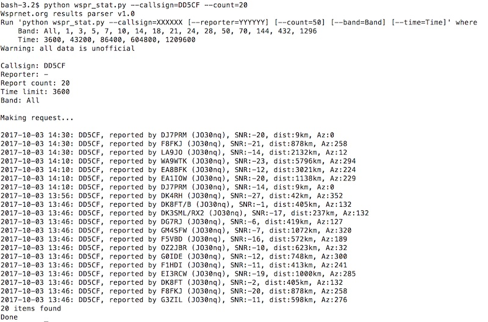

# WSPR-ResponseParser

Unofficial http://wsprnet.org data downloader and parser. Can be used for autonomous Raspberry Pi beacon, for obtaining stats, etc.

# Install

git clone https://github.com/dmitryelj/WSPR-ResponseParser.git

sudo pip install BeautifulSoup4

# Screenshots

